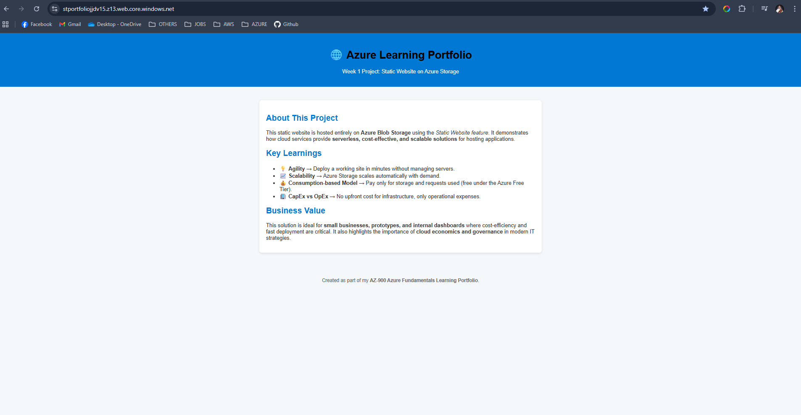

# 🌐 Static Website on Azure Storage

## 📌 Project Summary
In this project, I deployed a **static HTML website** using **Azure Blob Storage’s Static Website feature**.  
This demonstrates how to build a **serverless, scalable, and cost-effective** hosting solution within the **Azure Free Tier**.

---

## 🎯 Objectives
- Learn how to create and organize resources with **Resource Groups**.
- Deploy and configure a **Storage Account**.
- Enable and use the **Static Website feature**.
- Upload and serve files (`index.html`, `404.html`) from Azure Blob Storage.
- Verify the site is **live** and analyze costs (Free Tier).

---

## 🛠️ Steps Performed

### 1. Created Resource Group
- Name: `rg-azure-portfolio`  
- Purpose: Logical container to manage all resources for this project.  

---

### 2. Provisioned Storage Account
- Name: `stportfoliojjdv15`  
- Region: East US  
- Redundancy: Locally-redundant storage (LRS)  
- Service: Blob Storage  

---

### 3. Enabled Static Website Feature
- Configured **index.html** as the default document.  
- Configured **404.html** as the error page.  
- Copied the **Primary Endpoint** for browser testing.  

---

### 4. Uploaded Website Files
- Files uploaded to the special `$web` container.  
  - `index.html` (main page)  
  - `404.html` (error page)  

---

### 5. Verified Live Website
- Accessed via the **Primary Endpoint**:  
  `https://stportfoliojjdv15.z13.web.core.windows.net`  

---

### 6. Cost Analysis
- Verified through **Cost Management → Cost Analysis** that the project incurred **$0** charges (Free Tier).  

---

## 📖 AZ-900 Concepts Learned

### Cloud Concepts
- **Agility** → Deploy a website in minutes without infrastructure.  
- **Scalability** → Storage scales automatically with traffic.  
- **Consumption-based model** → Pay only for what you use (Free Tier included).  
- **CapEx vs OpEx** → No upfront cost (CapEx), only operational expense (OpEx).  

### Core Services
- **Storage Accounts** → Blob Storage as a PaaS service.  
- **Static Website feature** → Directly serve web content.  
- **Resource Groups** → Governance and resource organization.  

### Governance & Pricing
- Practiced **cost visibility** with Cost Analysis.  
- Validated **free-tier benefits**.  

---

## 💼 Business Value
This project shows how organizations can:
- Quickly publish **websites, dashboards, or prototypes** with no servers.  
- Save costs by leveraging **serverless PaaS services**.  
- Apply **good governance practices** (Resource Groups, monitoring, cleanup).  

---

## 🧹 Cleanup
After completing the project, I deleted the **Resource Group** to avoid unnecessary charges and practice cost governance.  
